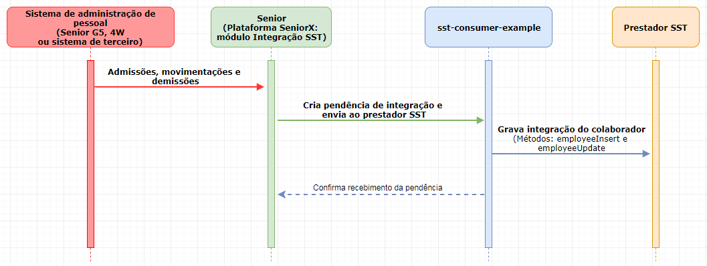

# Integração Senior com prestador SST
Projeto de demonstração (template) para integração das informações dos colaboradores e dos eventos de SST do eSocial entre o módulo Integrador SST da plataforma senior X e o prestador SST.

## Conceitos
A partir deste projeto (sst-consumer-example) é possível desenvolver uma API para integrar as informações dos colaboradores e dos eventos de SST do eSocial com o módulo Integrador SST da plataforma senior X. 

#### Módulo Integrador SST
A solução de Integrador SST da Senior atende as empresas que possuem um prestador de SST responsável por gerenciar as informações relacionadas a segurança do trabalho e medicina ocupacional.

O Integrador SST funciona totalmente em ambiente cloud, sendo responsável por enviar as informações dos colaboradores para o prestador e por receber os eventos do eSocial gerados por ele. Os eventos 
são enviados para o eDocs que, por sua vez, faz a transmissão para o Governo.

Quando a transmissão é bem-sucedida, o eDocs recebe o número do recibo do evento e, através do módulo Integrador SST, envia este número para o prestador. Caso o Governo devolva alguma crítica nas informações do evento, o eDocs também irá devolver este erro para o prestador, permitindo fazer os ajustes necessários e reenviar o evento.


#### Integração das informações dos colaboradores
As pendências de integração serão criadas somente quando alguma informação relevante do colaborador for alterada no sistema da Senior. 
 

Toda informação publicada pela Senior possui a informação "Motivo da integração". Os possíveis motivos de integração são:
- Carga inicial;
- Admissão;
- Demissão;
- Alteração de dados do colaborador;
- Alteração da matrícula eSocial;
- Alteração das informações adicionais;
- Movimentação de centro de custo;
- Movimentação de setor;
- Movimentação de categoria do eSocial;
- Movimentação de cargo;
- Movimentação de posto de trabalho;
- Movimentação de empresa;
- Movimentação de filial;
- Movimentação de turno;
- Movimentação de afastamento.

Os respectivos históricos do colaborador no sistema do prestador SST devem ser atualizadas conforme o motivo da integração.

Desta forma, é papel do desenvolvedor do sistema do prestador SST, desenvolver no projeto sst-consumer-example as rotinas necessárias para realizar as seguintes ações:
- Receber a pendência de integração com as informações do colaborador e verificar, através do CPF, se o colaborador já existe no prestador SST.
- Se o colaborador não existe no prestador SST, desenvolver rotina que insere o colaborador no sistema do prestador.
- Se o colaborador já existe no prestador SST, desenvolver rotina que atualiza as informações do colaborador, conforme o motivo da pendência de integração.
- Se a pendência for uma exclusão de uma admissão (`integration.getIntegrationType()` igual a `IntegrationType.NEW_EMPLOYEE` e `integration.getOperationType()` igual a `OperationType.DELETE`), desenvolver rotina que trate a exclusão da admissão no sistema do prestador. ATENÇÃO: RECOMENDAMOS NÃO EXCLUIR O COLABORADOR NEM QUALQUER INFORMAÇÃO DO MESMO, E SIM INATIVÁ-LO.


#### Integração dos eventos de SST do eSocial

Os eventos do eSocial (XML) gerados pelo prestador SST devem ser enviados a plataforma senior X através do projeto sst-consumer-example. 
Os seguintes eventos do eSocial são reconhecidos para envio pelo módulo Integrador SST:
- S-2210 - Comunicação de Acidente de Trabalho
- S-2220 - Monitoramento da Saúde do Trabalhador
- S-2240 - Condições Ambientais do Trabalho - Fatores de Risco
- S-3000 - Exclusão de Eventos

O envio dos XML deve ser feito individualmente (um a um). Cada XML enviado é validado, conforme estrutura e atributos do seu leiaute, antes de ser enviado ao 
governo. Caso o XML esteja inválido, ele não será considerado para envio ao governo.

O retorno dos eventos do eSocial (XML) enviados a plataforma senior X e que foram encaminhados ao governo, são retornados ao sistema do prestador SST através do 
projeto sst-consumer-example.

Desta forma, no projeto sst-consumer-example deve ser desenvolvido as seguintes ações:
- Enviar os eventos do eSocial (XML) para o Integrador SST da Senior.
- Receber o resultado da validação dos eventos do eSocial (XML) que foram enviados
ao Integrador SST da Senior.
- Receber o número do recibo e críticas/erros dos eventos do eSocial retornados pelo
governo e gravar essa informação no sistema do prestador SST.


## Desenvolvendo a integração

Altere ou implemente rotinas nos arquivos mencionados a seguir.

> **Observação:** Não há necessidade de alterar outros arquivos, além dos citados abaixo, para que a integração seja realizada com sucesso.


#### Parametrização do projeto - application.properties
Através do arquivo de parametrização do sistema, você pode indicar a URL da plataforma senior X utilizada. Durante o desenvolvimento é recomendável utilizar a URL de homologação e somente após implementar todas as rotinas, alterar para a URL de produção.

Nesse arquivo você pode alterar a porta utilizada no servidor para a integração. O valor padrão da porta é 8099.

Por padrão, o projeto sst-consumer-example utiliza uma base para armazenar as pendências de integração recebidas da plataforma senior X. No arquivo de parametrização do sistema,  você pode alterar os dados de conexão com essa base, que por padrão utiliza o banco de dados PostgreSQL e um database chamado seniorconsumersst. 

> **Observação:** O objetivo de armazenar a pendência numa base de dados temporária é apenas para facilitar o desenvolvimento e testes da integração. Após o término das implementações e testes relacionados a integração, tanto a base de dados como o código no projeto sst-consumer-example que grava a pendência de integração na base pode ser eliminado.

Além da configuração para conexão com o banco de dados, também está presente no arquivo de parametrização as configurações relacionadas a migração da base de dados. Embora a configuração esteja disponível, recomendamos não alterá-la enquanto utilizar a base para implementação e testes no desenvolvimento. 


#### Lista de credencias para integração com a plataforma senior X - CompanyCredentialsStrategyImpl.java
Todo cliente do módulo Integração SST deverá possuir uma chave de acesso específica cadastrada no gerenciamento de aplicações na plataforma SeniorX para a integração com o prestador SST. Será através dessa chave que será realizada a autenticação na plataforma SeniorX para o envio das informações dos colaboradores, assim como o envio dos XML do eSocial.

No método getCredentials, da classe CompanyCredentialsStrategyImpl, deve ser implementada a rotina que busca as chaves de acesso que são utilizadas para a integração com a plataforma SeniorX, de todos os clientes cadastrados no sistema do prestador SST.

Essa rotina é executada automaticamente quando a aplicação sst-consumer-example for iniciada. Entretante, é papel do desenvolvedor do sistema do prestador SST garantir que ela seja executada sempre que um novo cliente for cadastrado, alterado ou excluído no sistema do prestador, com o objetivo de manter a lista de chaves de acesso sempre atualizada.

#### Integração das informações dos colaboradores - EmployeeIntegrationStrategyImpl.java
Sempre que uma pendência de integração com informações dos colaboradores for recebida no projeto sst-consumer-example, o método employeeExists da classe EmployeeIntegrationStrategyImpl será executado. Implemente nesse método a 
rotina responsável por verificar se o colaborador já existe no sistema do prestador SST.

> **Observação:** Por padrão a verificação de que o colaborador existe é feito pelo CPF mas não há restrições para utilizar outras informações da pendência de integração para isso.

Nas situações em que o colaborador não existe, o método employeeInsert da classe EmployeeIntegrationStrategyImpl será executado. Implemente nesse método a rotina responsável por inserir o colaborador no sistema do prestador SST.

Quando o colaborador já existe no sistema do prestador SST, o método employeeUpdate dessa mesma classe, será executado. Implemente nesse método a rotina responsável por atualizar as informações do colaborador 
conforme o motivo de integração no sistema do prestador SST.

> **Observação:** Utilize a informação do motivo de integração (integration.getIntegrationType()) e do tipo de operação (integration.getOperationType() - Insert, Update, Delete) para determinar a alteração necessária no registro do colaborador no sistema do prestador SST.

Diagrama de sequência da integração:




#### Envio dos eventos do eSocial (XML) - sendXML - EsocialIntegrationController.java
Os eventos do eSocial (XML) são enviados a plataforma senior X através do serviço sendXML do projeto sst-consumer-example: 

[POST] {URL_sst-consumer-example}/esocial/sendXml

Parâmetros de entrada:

| Parâmetro | Tipo | Obrigatório | Objetivo |
| --- | --- | --- | --- |
| credential.accessKey |	Alfanúmerico |	Sim |	Chave de acesso da aplicação na plataforma SeniorX. |
| sendEsocialXmlInput.providerXmlId |	Alfanúmerico |	Não |	ID do XML no prestador SST. |
| sendEsocialXmlInput.providerCompanyId |	Alfanúmerico |	Não |	Código da empresa no prestador SST. |
| sendEsocialXmlInput.subscriptionType |	Alfanúmerico |	Não	| Tipo de inscrição da empresa. Valores possíveis: CNPJ, CPF, CAEPF, CNO, CEI |
| sendEsocialXmlInput.subscriptionNumber |	Alfanúmerico	| Não	| Número de inscrição da empresa, sem máscara de formatação. |
| sendEsocialXmlInput.xml |	Alfanúmerico |	Sim |	XML do evento do eSocial, sem quebras de linhas. |

Exemplo JSON:
```
{
    "credential" : {
        "accessKey" : "FqfWWem3Fv9vaVIEBiO_iHKeKOLa"
    },
    "sendEsocialXmlInput" : {
        “providerXmlId” : “999999999999”,
        “providerCompanyId” : “100200”,
        “subscriptionType” : “CNPJ”,
        “subscriptionNumber”: “68812876000176”,
        "xml" : "XML do eSocial sem quebras de linha"
    }
}
```

O envio dos XML deve ser feito individualmente (um a um). Cada XML enviado é validado, conforme estrutura e atributos do seu leiaute, antes de ser enviado ao governo. Caso o XML esteja inválido, ele não será considerado para envio ao governo.

Parâmetros de saída:

| Parâmetro | Objetivo |
| --- | --- |
| id | Identificador do registro na plataforma senior X. |
| providerXmlId | ID do XML no prestador SST. |
| xmlStatus	| Status do XML. Valores possíveis: IN_ANALYSIS, VALIDATION_SUCESS, VALIDATION_ERROR, SENDING_TO_GOVERNMENT, WAITING_GOVERNMENT_RETURN, GOVERNMENT_RETURN, SEND_XML_ERROR, CANCELED_BY_USER. |
| validationMessage | Mensagem referente a validação do evento. |
| eventId | ID do evento do eSocial. |
| governmentReturnType | Tipo de retorno do governo. Valores possíveis: RECEIPT_RETURNED e MESSAGE_RETURNED. |
| governmentReceiptNumber | Número do recibo retornado pelo governo. |
| governmentMessage | Mensagens ou críticas retornadas do governo. |
| rawGovernmentReturn | Retorno do governo. |
| companyProviderId | Código de identificação da empresa no prestador SST. |

#### Recebendo o retorno do recibo ou críticas/erros do governo - EsocialIntegrationStrategyImpl.java
O status dos eventos do eSocial (XML) enviados a plataforma senior X são retornados ao sistema do prestador SST pelo método eSocialStatusXml, da classe EsocialIntegrationStrategyImpl.

Antes do envio ao Governo, todos os XML recebidos do prestador SST são validados. Possíveis retornos:

| Retorno (Status) | Descrição |
| --- | --- |
| VALIDATION_SUCCESS | Nenhum erro foi encontrado e o XML está pronto para ser enviado ao Governo pela plataforma senior X. |
| VALIDATION_ERROR | Foram encontrados erros na validação do XML. |

Após envio do XML pela plataforma senior X, o retorno do Governo será o número do recibo (sucesso no envio) ou críticas/erros. Possíveis retornos:

| Retorno (Status) | Tipo de retorno | Descrição |
| --- | --- | --- |
| GOVERNMENT_RETURN | RECEIPT_RETURNED | O evento foi recebido com sucesso e retornou o número do recibo. |
| GOVERNMENT_RETURN | MESSAGE_RETURNED | O ambiente do Governo encontrou problemas ao receber o evento. |

Desta fora, implemente no método eSocialStatusXml, na rotina de validação com sucesso, a atualização do status do envio do XML no sistema do prestador SST, com a indicação que ele está pronto para envio ao governo pela plataforma senior X.

Caso a validação retorne erros, atualize o status do envio do XML no sistema do prestador SST, indicando que o XML não será enviado ao governo devido a problemas encontrados na validação. O erro encontrado na validação pode ser consultado através do atributo validationMessage.

Para as situações em que o governo retornar o recibo do XML do evento do eSocial, implemente na opção GOVERNMENT_RETURN a verificação do tipo de retorno (statusEsocialXmlDTO.governmentReturnType):
- Se o tipo de retorno for "recibo retornado" (GovernmentReturnType.RECEIPT_RETURNED), atualize o status do envio do XML no sistema do prestador SST e atribua o recibo ao respectivo evento;
- Se o tipo de retorno for "mensagem retornada" (GovernmentReturnType.MESSAGE_RETURNED), atualize o status do envio do XML no sistema do prestador SST com as críticas/erros retornados.

As críticas/erros retornados podem ser consultados através do atributo governmentMessage.
